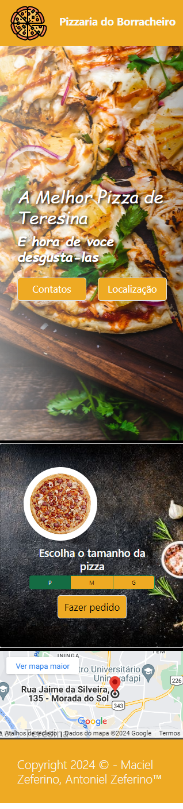

# Pizzaria do Borracheiro - README

## Overview
Este projeto é um site simples para a "Pizzaria do Borracheiro", um local de pizza fictício localizado em Teresina. O site fornece informações básicas sobre a pizzaria, incluindo seu nome, slogan, opções de menu, detalhes de contato e localização. Ele também incorpora o Bootstrap para estilização e responsividade.

## Recursos
1. **Cabeçalho**: Inclui o logo e o nome da pizzaria.
2. **Seção Principal**: Apresenta a pizzaria e incentiva os visitantes a experimentarem suas pizzas. Contém botões para contatar a pizzaria e navegar até a seção de localização.
3. **Seção de Cartões**: Exibe uma imagem e permite que os usuários escolham o tamanho da pizza (pequena, média ou grande) usando botões de rádio. Os usuários também podem clicar em um botão para fazer um pedido.
4. **Rodapé**: Inclui um mapa do Google Maps incorporado mostrando a localização da pizzaria e um aviso de direitos autorais.

## Tecnologias Utilizadas
- HTML5: Linguagem de marcação para estruturar a página da web.
- CSS3: Linguagem de folha de estilo para melhorar a apresentação visual.
- Bootstrap: Framework front-end para desenvolvimento de sites responsivos e móveis.
- JavaScript: Linguagem de script para adicionar interatividade à página da web.

## Instalação
1. Clone o repositório para sua máquina local:

2. Navegue até o diretório do projeto:

3. Abra o arquivo `index.html` em um navegador da web.

## Uso
- Explore o site para aprender sobre a Pizzaria do Borracheiro.
- Clique no botão "Contatos" para contatar a pizzaria via WhatsApp.
- Clique no botão "Localização" para ir para a seção de rodapé onde o mapa é exibido.
- Escolha o tamanho da pizza e clique em "Fazer pedido" para fazer um pedido.

## Licença
Este projeto está licenciado sob a Licença MIT. Consulte o arquivo [LICENSE](LICENSE) para obter detalhes.

## Autor
- Maciel Zeferino
- Antoniel Zeferino

## Agradecimentos
- Imagens obtidas de provedores externos.
- API do Google Maps usada para incorporar o mapa.

## Contatos
### Maciel Zeferino
  
### Antoniel Zeferino
 

## Imagens do projeto

